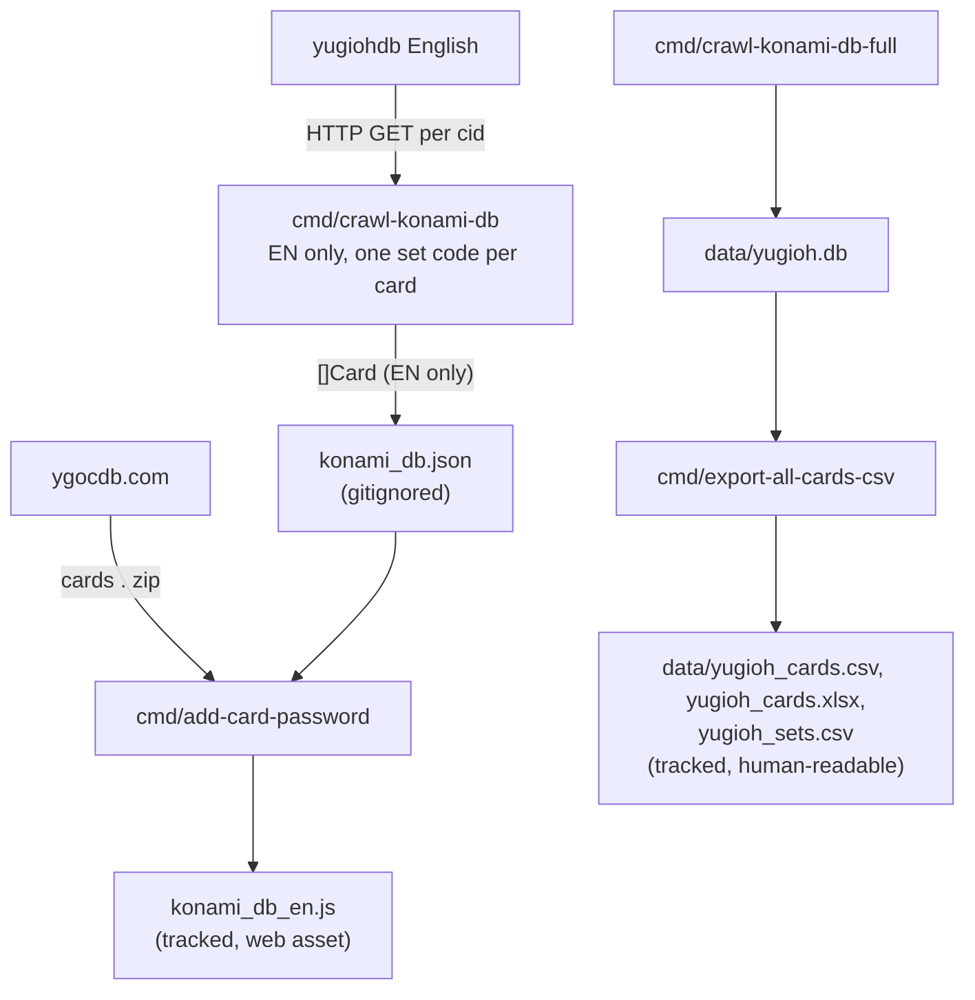

# Card Data Collection

Documents how card data is currently collected, parsed, and output.
Updated as the full database feature progresses.
This is a reference for building `cmd/crawl-konami-db-full`.

## Data sources

### Konami DB (TCG/OCG cards)

URL pattern: `https://www.db.yugioh-card.com/yugiohdb/card_search.action?ope=2&request_locale=en&cid={cardID}`

- `request_locale` can be `en`, `ja`, `ko`
- Card IDs are integers; first known card is 4007 (Blue-Eyes White Dragon)
- A page returns "Card information not found" for IDs that do not exist
- The crawler stops after 400 consecutive not-found IDs (sufficient based on observed gaps)
- The JA locale has the most complete card ID coverage: OCG-only cards exist
  in JA but not EN; newer cards may have JA/KO text before EN is available
- JA pages also display the EN name when the card has a TCG release

What each card page contains:

- Card name, effect text
- Card type / subtype (Monster/Spell/Trap, Normal/Effect/Fusion/...)
- Monster stats: attribute, type, level/rank/link, ATK, DEF
- Monster abilities: Tuner, Flip, Spirit, etc.
- Pendulum scale and pendulum effect (if applicable)
- Link arrows (if Link Monster)
- All prints of this card: each print has date, set code, set name, rarity

### Konami Rush Duel / Duel Links DB

URL pattern: `https://www.db.yugioh-card.com/rushdb/card_search.action?ope=2&request_locale=ja&cid={cardID}`

- Available in Japanese and Korean (`request_locale=ja` and `request_locale=ko`)
- First known card ID is 15150
- Rush Duel card IDs do not collide with TCG/OCG IDs (different numeric ranges)
- Extra fields: `RushIsLegend` (bool), `RushMaximumATK` (string)

### YGOCDB

URL: `https://ygocdb.com/api/v0/cards.zip` — a ZIP containing `cards.json`

Provides the 8-digit Password printed on the bottom-left of physical cards.
Konami DB does not expose this. YGOCDB maps their `id` field to Konami card ID.
A static snapshot is embedded at `pkg/core/ygocdb_card_password.json` for offline use.

### Sets

Set data (abbreviation, names, release date, OCG vs TCG) comes from the prints
listed on Konami card pages, stored in the `sets` table of `data/yugioh.db`.
A manually saved Yugipedia set chronology page used to provide title-case English set names;
it was removed once `cmd/export-all-cards-csv` started writing `data/yugioh_sets.csv` from the database.

---

## Existing pipeline diagram

## Existing Go code

- `cmd/crawl-konami-db`: crawls EN card pages (IDs 4000+, 32 goroutines), parses
  with `konami.ParseKonamiCardHTML`, writes to `konami_db.json`. Only stores one set
  code per card; has a TODO to cache raw HTML.
- `pkg/konami/parse.go`: parses TCG/OCG card HTML. Extracts all `t_row` prints
  but discards all except the last one. Each `t_row` has date, set code, set name,
  rarity — all currently unused except year and set code.
- `pkg/konami/rush_card.go`: parses Rush Duel card HTML, same `t_row` structure.
  No crawl cmd exists yet.
- `cmd/add-card-password`: merges YGOCDB passwords into `konami_db.json`,
  outputs `konami_db_en.js` (web asset).
- `cmd/crawl-konami-db-full`: rebuilds `data/yugioh.db` from Konami card pages (a few minutes).
- `cmd/export-all-cards-csv`: reads `data/yugioh.db` (a few seconds)
  and exports `yugioh_cards.csv` (human-readable): every card with an English name,
  set columns from its first English print.
  The same rows go to `yugioh_cards.xlsx`, with rows colored by card type.
  It also writes `yugioh_sets.csv`, every set from the database.

---

## Current output files

| File                                 | Format                | Tracked | Purpose                                  |
|--------------------------------------|-----------------------|---------|------------------------------------------|
| `web/konami_data/konami_db.json`     | JSON array of Card    | No      | Intermediate; input to add-card-password |
| `web/konami_data/konami_db_en.js`    | JS const CardDatabase | Yes     | Web app card database                    |
| `data/yugioh_cards.csv`              | CSV                   | Yes     | Human-readable card list                 |
| `data/yugioh_cards.xlsx`             | XLSX                  | Yes     | Same list, rows colored by card type     |
| `data/yugioh_sets.csv`               | CSV                   | Yes     | Every set, from `data/yugioh.db`         |
| `pkg/core/ygocdb_card_password.json` | JSON                  | Yes     | Static password snapshot                 |

`web/konami_data/alt_arts.js` is a separate web asset not part of this pipeline.
It is generated from `github.com/daominah/yugioh_master_duel_card_art/alt_arts.json`,
a manually maintained file in a separate repo.

---

## What the existing pipeline does NOT do

- Does not store raw HTML (only parses and discards it)
- Does not collect all prints per card (only one set code per card)
- Does not collect set names or rarity from card pages
- Does not crawl `request_locale=ja` or `request_locale=ko`
- Does not crawl Rush Duel/Duel Links cards (parser exists, no cmd)
- Does not expose set data to the web app
